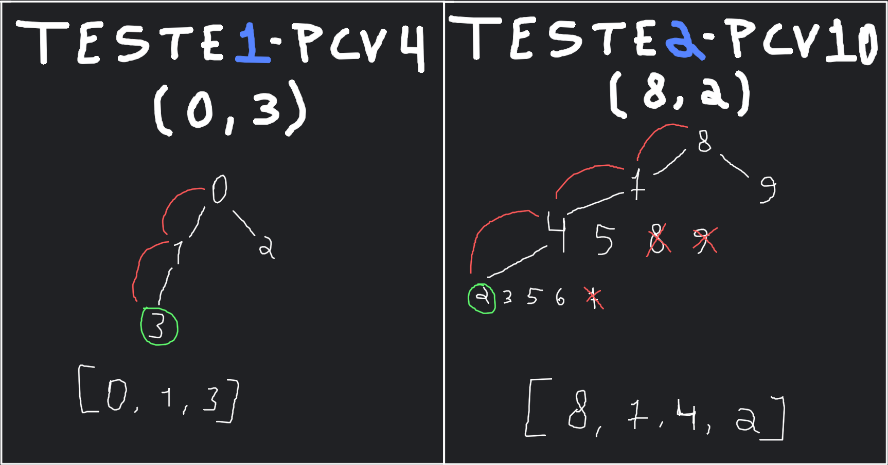
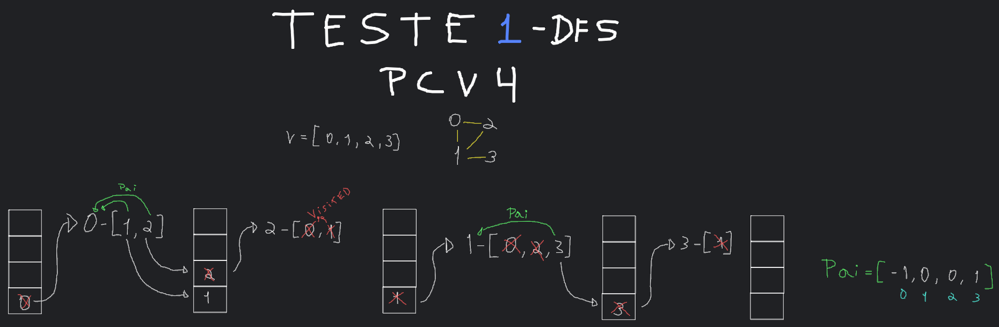

# Implementação da estrutura de <b>Grafos</b> em Python.

- [x] Leitura de arquivos e carregamento das estruturas do Grafo
- [x] Busca em largura (BFS)
    - [x] Método bfs_search(v1, v2) para imprimir o caminho entre dois vértices. Se não houver, indica que não há caminho.

- [x] Busca em Profundidade (DFS)
    - [x] Reimplementação do dfs_pilha() com auxílio de uma pilha para eliminar a recursão da implementação.


[<h2>Testes</h2>](#testes) [testes-bfs_search](#bfs_search) | [teste-dfs_pilha](#dfs_pilha)

### bfs_search

[teste 1 - pcv4 (bfs_test1.py)](/cdigo_grafo/bfs_test1.py)<br>
[teste 2 - pcv10 (bfs_test2.py)](/cdigo_grafo/bfs_test2.py)<br>
[teste 3 - pcv50 (bfs_test3.py)](/cdigo_grafo/bfs_test3.py)<br>
[teste 4 - pcv177 (bfs_test4.py)](/cdigo_grafo/bfs_test4.py)<br>



```bash
>> python3 bfs_test1.py
Listas de adjacências
0 - [1, 2]
1 - [0, 2, 3]
2 - [0, 1]
3 - [1]

v1: 0, v2: 3
Caminho: [0, 1, 3]
```

```bash
>> python3 bfs_test2.py
Listas de adjacências
0 - [1]
1 - [0]
2 - [3, 4, 5, 6]
3 - [2, 4, 5, 6]
4 - [2, 3, 5, 6, 7]
5 - [2, 3, 4, 6, 7]
6 - [2, 3, 4, 5, 7]
7 - [4, 5, 8, 9]
8 - [7, 9]
9 - [7, 8]
v1: 8, v2: 2
Caminho: [8, 7, 4, 2]
```

#### Outros testes

```bash
>> python3 bfs_test3.py
[...]
```

```bash
>> python3 bfs_test4.py
[...]
```

### dfs_pilha

[teste 1 - pcv4 (dfs_test1.py)](/cdigo_grafo/dfs_test1.py)<br>
[teste 2 - pcv10 (dfs_test2.py)](/cdigo_grafo/dfs_test2.py)<br>


    
```bash
>> python3 dfs_test1.py
DFS com recursividade
lista de vértices pai: [-1, 0, 1, 1]

DFS com pilha
lista de vértices pai: [-1, 0, 0, 1]
```

#### Outros testes

```bash
>> python3 dfs_test2.py
DFS com recursividade
lista de vértices pai: [-1, 0, -1, 2, 3, 4, 5, 6, 7, 8]

DFS com pilha
lista de vértices pai: [-1, 0, -1, 2, 2, 2, 2, 6, 7, 7]
```